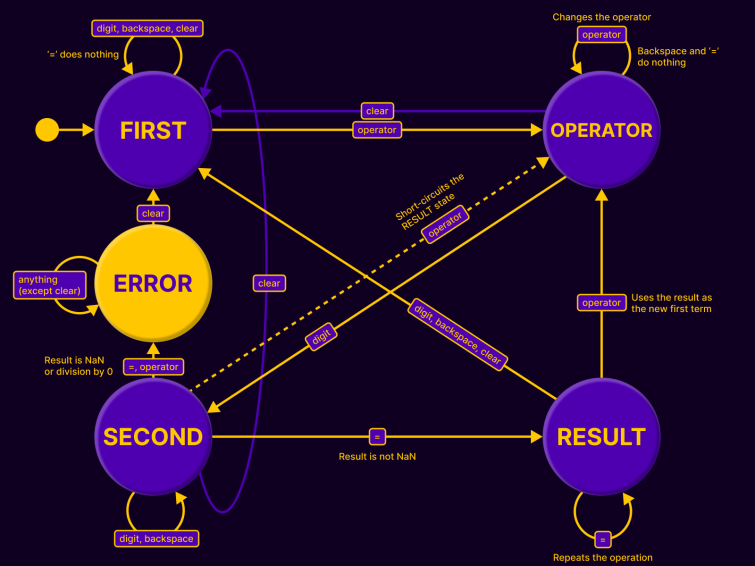

# Odin Landing Page
## About
This is my submission for the [Calculator project](https://www.theodinproject.com/lessons/foundations-calculator) inside the [TOP](https://www.theodinproject.com/) curriculum. Key features of my implementation:
- Uses a skeuomorphic user interface.
- Can handle negative numbers.
- Can handle floating point numbers.
- Rounds the result of any calculation to 5 decimal places.
- Throws errors when the inputs are not valid integers or when the user attempts to divide by 0.
- Handles the operations using a **Finite State Machine**.
### State transition diagram

## What I learned
The code uses a lot of helper function and switch statements to handle the input based on the current state.
Here is what happens when the user enters a digit or a decimal point, depending on the current state:
```js
function onDigit(val) {
  switch(currentStage) {
    case "FIRST":
      addDigit(val);
      break;
    case "OPERATOR":
      setStage("SECOND");
      clearDisplay();
      addDigit(val);
      break;
    case "SECOND":
      addDigit(val);
      break;
    case "RESULT":
      setStage("FIRST");
      clearDisplay();
      addDigit(val);
      break;
  }
}
```
The CSS uses a lot of shadows (due to the design chosen). This code allows for a smooth transition between the shadows:
```css
button {
  /* ... */
  box-shadow: 3px 3px 3px 1px rgba(0,0,0,0.1),
              inset -3px -3px 3px 1px rgba(0,0,0,0.3),
              inset 3px 3px 3px 1px rgba(255,255,255,0.3),
              inset 0px 0px 0px 0px #000000;
}
button:active, .pressed {
  box-shadow: 0px 0px 0px 0px rgba(0,0,0,0.1),
              inset 0px 0px 0px 0px rgba(0,0,0,0.3),
              inset 0px 0px 0px 0px rgba(255,255,255,0.3),
              inset 0px 0px 5px 2px #000000;
}
```
The `currentStage` variable holds discrete values representing each state (similarly to an enum).
```js
let currentStage = "FIRST"; // "FIRST" | "OPERATOR" | "SECOND" | "RESULT" | "ERROR"
```